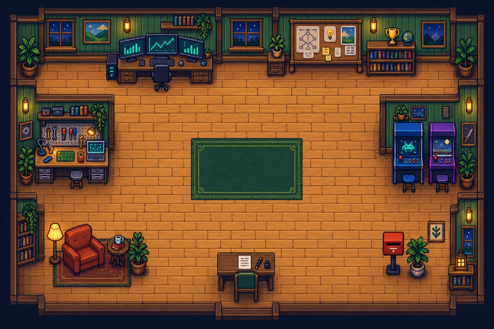

# Adit’s World · Adit Shah’s 2D Portfolio

A playable portfolio that opens directly into a full-screen, top-down 2D workshop. Walk a pixel-art character between interactive stations to explore my work. A separate reading view gives visitors quick access to the same professional content.

I’m an MS Computer Science student at North Carolina State University, graduating in **May 2027**, exploring new-grad opportunities in software development, software engineering, applied AI, and quantitative development or research.

[Portfolio URL](https://adit-2d-portfolio.vercel.app) · [GitHub](https://github.com/CodeRockerr) · [LinkedIn](https://www.linkedin.com/in/shah-adit0404/) · [Google Scholar](https://scholar.google.com/citations?user=Opd4raEAAAAJ&hl=en)

> This redesign is local source code until you deploy it. The portfolio URL above may still show the earlier version.



## Experience

- **Playable homepage:** original top-down environment and directional walking sprites generated with ChatGPT, with four aligned animation frames for each direction. Keyboard movement, click-to-walk paths around furniture, mobile directional controls, a view of the complete room, seven interactive stations and in-game content panels.
- **Quick access:** clicking an object, numbered marker or section in the navigation dock opens the content immediately. Quick travel also opens any station. The optional `/overview/` reading view presents projects, experience and contact details on one accessible page. Walking animation stays enabled, with no on/off control. System reduced-motion preferences still suppress decorative CSS motion and smooth scrolling.
- **AEQUITAS:** a dedicated project page for the quantitative research platform and its C++20/pybind11 feature-engineering work, with a small interactive rolling-mean explainer using synthetic data.
- **Selected projects:** CoughSense, WolfTrace, WolfVest, ongoing C++ Game Engine Foundations coursework, and undergraduate projects WattWatch, StockX and RecipeAI. Each has a distinct visual, technology tags and accessible details; filters cover AI applications, embedded AI, C++, IoT/mobile and quantitative data.
- **Professional experience:** four internships across NC State research, a startup, business software and IoT applications.
- **Achievements:** the trophy station and `/achievements/` present the poster and both hackathon awards as image-and-story features, plus WattWatch’s top-five placement among 75 projects at Smart India Hackathon. Hackathon results appear only here, keeping the room and project descriptions focused on exploration and the work itself.
- **Research and recognition:** WolfTrace’s **2nd Place at HackNCState 2026**, WolfVest’s **Best Use of Snowflake API at HackNC 2025**, and CoughSense’s **Best Poster Award at NC State’s AI Student Symposium 2026**. The research destination separately presents the downloadable poster, publications and Google Scholar.
- **Contact:** both `ashah45@ncsu.edu` and `shahadit62@gmail.com` in the footer, a résumé view/download callout, and an always-visible Contact Adit shortcut and mailbox station with direct email, LinkedIn, copyable email address and a link to feedback. `/contact/` works as a standalone page.
- **CppCon:** a permanent landing page connecting the conference presentation to AEQUITAS without making the entire portfolio conference-specific.
- **Private feedback:** an optional Formspree integration with validation, timeout handling, an anti-spam honeypot and a clearly labeled email-draft fallback.
- **Direct access:** résumé download, contact links, semantic content, page-specific metadata, social previews, canonical URLs, sitemap and robots file.

**PostHog is intentionally not installed.** This version includes no analytics SDK, session recording or tracking events. Setup guidance for a later integration is in [Service setup](docs/SERVICE_SETUP.md).

## Run locally

Requirements: Node.js **20.19+ within Node 20**, or **22.12+**, and npm. A currently supported Node LTS release is recommended.

From the repository root:

```sh
npm --prefix vite-project ci
npm run dev
```

Open **http://127.0.0.1:5173**. The root package provides convenience commands; application dependencies and the application lockfile live in `vite-project/`.

Build and inspect the production version:

```sh
npm run build
npm run preview
```

The production preview runs at **http://127.0.0.1:4173**. Output is generated in `vite-project/dist/`, which is ignored by Git.

## Pages

| URL            | Content                                                                          |
| -------------- | -------------------------------------------------------------------------------- |
| `/`            | Full-screen playable world with seven stations |
| `/overview/` | Optional reading view of the complete portfolio |
| `/#aequitas` | AEQUITAS in-game panel |
| `/#publications` | In-game research, publications and poster content |
| `/#about` | Profile photo, background and contact links in-game |
| `/#resume` | Current résumé PDF and QR in-game |
| `/#projects`   | In-game panel with filterable project cards                                                         |
| `/#experience` | In-game panel with internship experience                                                            |
| `/aequitas/`   | Quantitative platform, C++20 extension and interactive explainer                 |
| `/research/`   | CoughSense, award, poster, publications and presentation                         |
| `/cppcon/`     | CppCon presentation and networking links                                         |
| `/achievements/` | Dedicated hackathon and research recognition |
| `/#achievements` | Direct link to the in-game achievements panel |
| `/contact/` | Email, LinkedIn, copy address and contact preferences |
| `/#contact` | In-game contact panel |
| `/feedback/`   | Private feedback form or email-draft fallback                                    |
| `/privacy/`    | Current analytics and feedback behavior                                          |
| `/404.html`    | Missing-page fallback                                                            |

Each route is emitted as an HTML document. The game uses JavaScript for movement and panels; its station links and a prominent no-JavaScript link lead to readable pages. `/overview/` and the other reading pages contain their main content before JavaScript loads.

## Game controls

| Input | Action |
| --- | --- |
| WASD or arrow keys | Walk around the workshop |
| Click/tap the floor | Walk to a reachable floor position |
| Click an object, numbered marker or dock section | Open its panel immediately |
| E or the interaction button | Open a nearby object from any accessible edge |
| M or Quick travel | Choose a station without walking |
| Escape or Back to game | Close the content panel |
| Mobile directional pad | Hold an arrow to walk; the complete room stays visible |
| Contact Adit | Open email, LinkedIn and feedback options immediately |

The complete room fits within the available space at every screen size, with controls outside the map. Short phone screens scroll vertically so the room, movement controls, résumé actions and email addresses remain readable. Section names use readable 16px type in a desktop navigation dock and 14px type in a compact phone dock. Small numbered markers connect desktop navigation to the furniture without covering it. Objects remain directly clickable. Longer content uses consistent typography and spacing in reading pages and in-game panels.

Adit uses one transparent 4 × 4 sprite sheet for all directions. Measured frame bounds align the feet and normalize visible height, preventing jumps when changing direction. Each direction has an idle pose and a four-frame walking cycle. The character stays proportional to the room as the screen changes size. E uses distance to furniture bounds; when interaction zones overlap, facing direction helps select the intended object. The matching marker, dock section and footer action identify what E will open.

Discovery counts last only for the current page session. They are not stored or transmitted. Movement pauses while a content dialog is open or the page loses focus.

## Architecture

The application uses **Vite 8**, plain JavaScript modules, semantic HTML and CSS. There are no runtime framework dependencies or game-engine downloads. The game is an image-backed DOM scene with a directional sprite, collision bounds, A* pathfinding and a room-fitting viewport. Its destinations are accessible links, and content panels use native HTML dialogs.

```text
vite-project/
├── index.html                 # Home document shell
├── aequitas/, research/, ...  # Individual page shells
├── src/
│   ├── content.js             # Profile, experience, projects, publications, metadata
│   ├── render.js              # Shared layout and page templates
│   ├── styles.css             # Design system and responsive layouts
│   ├── main.js                # Navigation, filtering and project dialogs
│   ├── game-render.js         # Full-screen scene, HUD, section dock and panel templates
│   ├── game.js                # Movement, camera, sprite frames and station interaction
│   ├── game-world.js          # Stations, collisions and A* pathfinding
│   ├── game.css               # Game presentation and mobile controls
│   ├── studio.js              # Optional reading-view isometric scene
│   ├── studio-math.js         # Reading-view floor calculations
│   ├── features.js            # Synthetic series and rolling-window calculations
│   ├── feature-lab.js         # Interactive AEQUITAS explainer
│   ├── feedback-core.js       # Validation, drafts and provider request handling
│   └── feedback.js            # Feedback form UI
├── public/
│   ├── art/                  # Optimized WebP environment, sprites and poster preview
│   └── documents/            # Résumé and CoughSense poster PDFs
├── tests/                    # Unit and desktop/mobile browser tests
├── vite.config.js            # Static rendering, build entries and sitemap generation
├── playwright.config.js      # Mocked provider and unconfigured test servers
└── vercel.json               # Deployment settings and response headers
docs/
├── SERVICE_SETUP.md          # Feedback activation and deferred analytics setup
├── CONTENT_NOTES.md          # Sources, editorial decisions and missing material
├── COMMIT_PLAN.md            # Suggested feature/fix commits; no commits performed
├── ARTWORK.md                # Exact generation prompts and asset provenance
├── art/                     # Original generated PNGs and poster render
└── legacy/                  # Previous Kaboom implementation and source assets
```

`vite.config.js` renders the shared templates into the HTML shells during development and production builds. No routing service or catch-all SPA rewrite is required. Nested URLs should resolve to their own `index.html` files.

## Customize content

- Edit identity, professional links, experience and project records in `src/content.js`.
- Update long-form page copy and layouts in `src/render.js`.
- Update reading-view colors and spacing in `src/styles.css`; game layout and controls live in `src/game.css`.
- Edit station locations, approach points, interaction bounds and collision bounds together in `src/game-world.js` when replacing the map. The pathfinding tests verify that all stations remain reachable.
- Replace `public/documents/adit-shah-resume.pdf` when the résumé changes; existing links continue working.
- The About section uses the supplied LinkedIn photo. The original image is presented through a CSS portrait frame; clicking it opens the full photo.
- The résumé QR points directly to the portfolio-hosted PDF, not GitHub. SVG and downloadable PNG versions are regenerated by `predev` and `prebuild` using `VITE_SITE_URL` (or `profile.siteUrl`) and `profile.resume`. Run `npm --prefix vite-project run qr:generate` to regenerate them manually. Replacing the PDF at the same URL does not require a new QR.
- A QR scan opens the public website, even while viewing the local preview. Deploy the PDF before sharing the new QR. Already distributed copies of the old QR retain their original destination.
- Add the CppCon poster PDF and repository URLs when ready. The supplied CoughSense poster is a separate research presentation.
- The game-engine project is explicitly **in progress**. No finished features or benchmarks are claimed.

The interactive feature explainer uses synthetic prices and JavaScript calculations. It does **not** execute the AEQUITAS extension, display real market data or benchmark native C++.

## Feedback configuration

The site runs without any accounts or environment variables. In that mode, the feedback form prepares an email draft; the visitor must open their email app and send it. It does not claim to have delivered a message.

For direct private submissions, create a Formspree form and copy `vite-project/.env.example` to `vite-project/.env.local`:

```dotenv
VITE_FORMSPREE_FORM_ID=your_public_form_id
VITE_SITE_URL=https://adit-2d-portfolio.vercel.app
```

Use the form ID from the endpoint, not the full endpoint URL or a private key. Restart the development server after editing the file. Production environment variables are applied at build time, so a new build is required.

Full account setup, private inbox access, provider spam controls and verification steps: [Service setup](docs/SERVICE_SETUP.md).

## Validation

```sh
npm test
npm --prefix vite-project run format:check
npm run build
```

Browser tests use Playwright and run against two local servers: one with a **mocked** Formspree endpoint and one with feedback unconfigured. They do not send real feedback or contact external recipients.

```sh
cd vite-project
npx playwright install chromium
npm run test:browser
```

Alternatively, use an installed Chrome binary on macOS:

```sh
PLAYWRIGHT_CHROMIUM_EXECUTABLE_PATH='/Applications/Google Chrome.app/Contents/MacOS/Google Chrome' npm run test:browser
```

Tests cover routes between every pair of game stations, furniture collisions, keyboard and touch movement, whole-room framing, in-game panels, quick travel, browser history, markers clear of furniture and readable dock links, four-direction animation, complete rolling windows, feedback delivery/failures, clipboard success and failure, hackathon recognition, narrow and landscape layouts, focus restoration, downloads, always-enabled walking, system motion preferences for decorative effects, and content without JavaScript. Browser screenshots are written to `vite-project/test-results/`.

Before your own commit, manually check:

1. Explore the game on a phone and desktop; try every station, quick travel and the optional reading view.
2. Use keyboard navigation, project filters and Escape to close dialogs.
3. Confirm the résumé, research poster and professional links.
4. Try the feature slider on the AEQUITAS page.
5. Once configured, send one real feedback submission and confirm it in your private Formspree inbox.
6. Review all dates, project descriptions and the content items listed in [Content notes](docs/CONTENT_NOTES.md).

## Deployment

The existing public URL can stay the same. For a Vercel project, use:

| Setting          | Value           |
| ---------------- | --------------- |
| Root Directory   | `vite-project`  |
| Framework        | Vite            |
| Install Command  | `npm ci`        |
| Build Command    | `npm run build` |
| Output Directory | `dist`          |

Set `VITE_FORMSPREE_FORM_ID` and `VITE_SITE_URL` in the relevant deployment environment before building. Preserve static nested-page routing; do not redirect every request to the homepage. Test `/aequitas/`, `/research/`, `/feedback/`, `/cppcon/`, the PDFs and an unknown URL after deployment.

No deployment, Git commit or Git push is performed by this project. See [Suggested commits](docs/COMMIT_PLAN.md) for a reviewable feature-by-feature breakdown.

## Artwork and attribution

The top-down game map, directional walking sprites and optional isometric scene were generated through ChatGPT’s built-in image generation, then converted to WebP for delivery. Original PNGs and exact prompts are retained in [Artwork](docs/ARTWORK.md). The avatar is an illustration, not a photographic likeness.

The original portfolio used Kaboom and referenced [jslegenddev’s tutorials](https://youtube.com/@jslegenddev). Its source and assets are preserved in `docs/legacy/` for reference and are not part of the production bundle. The previous repository’s `monogram.ttf` provides the pixel typography for game controls and panel headings; longer body text uses system fonts.

The résumé and CoughSense poster were provided by Adit Shah. The poster credits **Adit Shah, Darsh Rank and Pratham Patel**. Third-party marks within that supplied document belong to their respective owners. No new license is implied for these materials.
